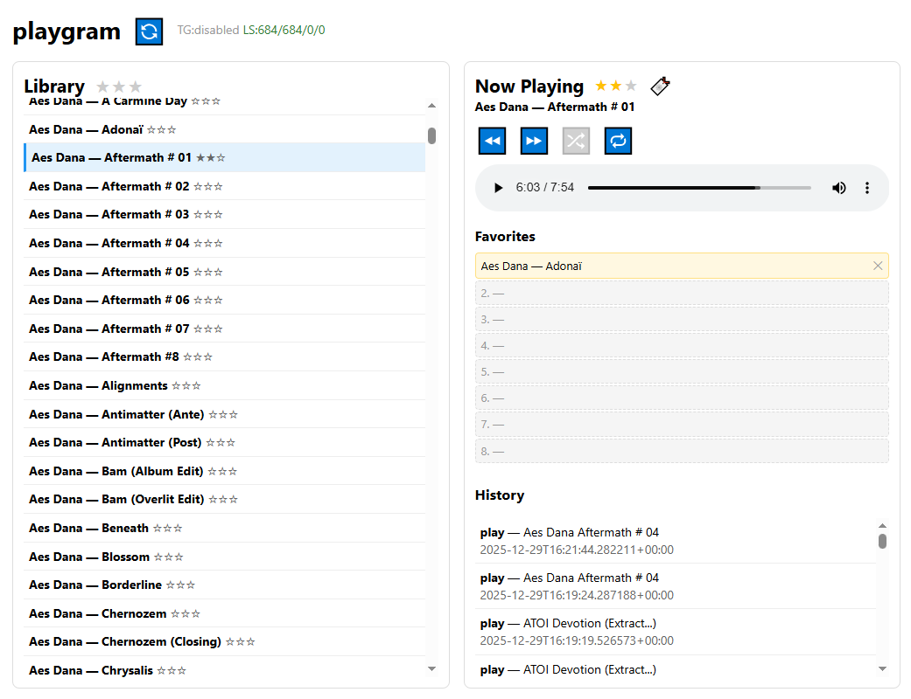

# playgram

A minimalist local music player that syncs audio from Telegram chats, with ratings, playback history, background synchronization, and automatic metadata extraction from audio files.



## Features
- **Two-phase sync:**
  - TG phase: download audio from Telegram chat/channel (optional, `SYNC_TELEGRAM_ENABLED=false` to disable)
  - LS phase: scan local files, create records, extract metadata (artist, title, album, year, duration), remove orphan records
- **Works without Telegram:** manually copy files to `data/downloads/` and run sync — LS will create records from file metadata
- Track library + browser playback (HTML5 audio)
- **Favorites:** 8 slots for quick track access (stored in localStorage)
- **URL params:** `?track=123&pos=45` — save and restore playback position
- Rating system: 1-3 stars per track (saved to DB and file tags) with tooltips (Low/Medium/High)
- Filter by exact rating (with tooltip hint)
- Library navigation (prev/next buttons)
- Shuffle and loop modes (off / all / one) with state persistence
- Current track highlighting in library
- Compact UI that stretches to full window height
- Playback history (play/ended events)
- Rate limiting protection during sync (delays between requests)
- Parallel sync protection (asyncio.Lock + task check)
- Sync status display: `TG:scn/dl/err LS:fnd/new/upd/del` (or `TG:disabled`)

## Requirements
- Python 3.11+
- Docker (optional, for deployment)

## Quick Start (local)

1. Create a Telegram API application: https://my.telegram.org

2. Copy `.env.example` → `.env` and fill in:
   ```
   TELEGRAM_API_ID=...
   TELEGRAM_API_HASH=...
   TELEGRAM_CHAT=username_or_id
   ```

3. Install dependencies:
   ```bash
   python -m pip install -e .
   ```

4. Authorize in Telegram (creates session file):
   ```bash
   python -m playgram.telegram.login
   ```

5. Run:
   ```bash
   python -m playgram
   ```

6. Open:
   - UI: http://127.0.0.1:8000/ui/
   - API docs: http://127.0.0.1:8000/docs

## Docker

```bash
docker compose build
docker compose up -d
```

Data is stored in `./data/` (volume mount).

## How Sync Works

When clicking 🔄 (or `POST /api/sync/start`):

1. **TG Phase (Telegram)** — scans messages in chat, downloads new audio files (skipped when `SYNC_TELEGRAM_ENABLED=false`)
2. **LS Phase (Local Scan)** — scans files in `downloads/`, creates records for new files, extracts metadata (mutagen), removes orphan records, syncs rating to file tags

Status is displayed in compact format:
- `TG:614/22/0` — scanned/downloaded/failed (or `TG:disabled` when `SYNC_TELEGRAM_ENABLED=false`)
- `LS:684/684/0/0` — found/created/updated/orphans_deleted

**Rating in files:** when rating changes, it's written to audio file tags (MP3: POPM, FLAC/OGG: RATING). During sync, rating from DB is synced to file.

Parallel runs are blocked — repeated click returns current status.

## Data Structure

```
data/
├── playgram.sqlite3      # DB (tracks, tags, history, sync_jobs)
├── telegram.session      # Telegram session
└── downloads/
    └── {chat_id}/        # Downloaded audio files
```

## API

| Method | Path | Description |
|--------|------|-------------|
| GET | /api/tracks | List tracks |
| GET | /api/tracks/{id} | Track info |
| PUT | /api/tracks/{id}/rating | Set rating |
| POST | /api/sync/start | Start sync |
| GET | /api/sync/status | Sync status |
| GET | /api/history | Playback history |

## Notes
- Unique track key is `local_path` (file path)
- File metadata (ID3 tags) takes priority over Telegram data
- Tracks without file on disk are automatically removed during sync
- Rating is saved to DB and duplicated to file tags (MP3: POPM, FLAC/OGG: RATING)
- Telegram session file requires interactive authorization on first run
- Can work without Telegram: put files in `data/downloads/` and set `SYNC_TELEGRAM_ENABLED=false`
